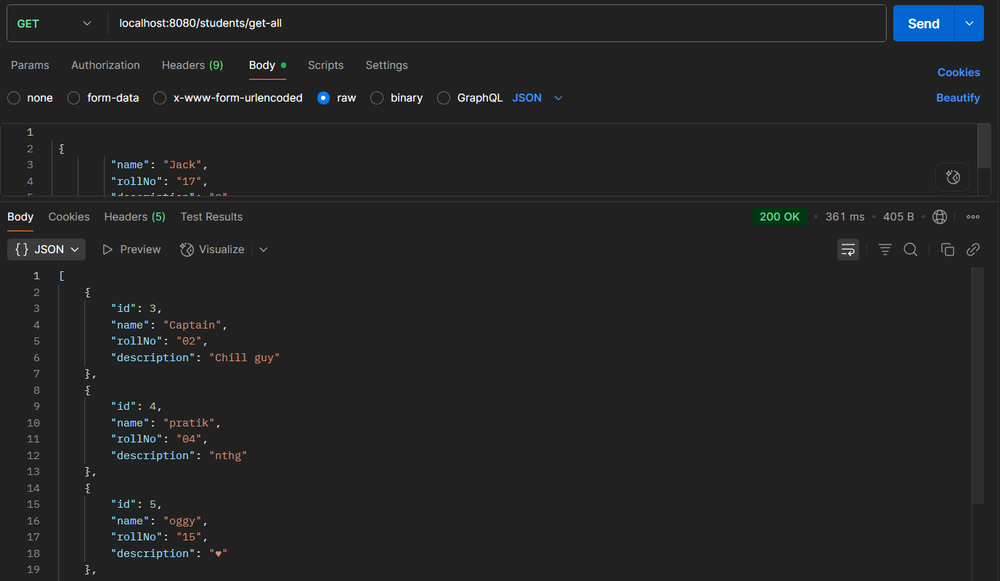

# Student API

## Description
A RESTful API built with Java and Spring Boot for managing student data.  
Supports basic CRUD (Create, Read, Update, Delete) operations.

## Screenshot


## Features
- Add new students
- View all students or a single student by ID
- Update student details
- Delete students
- JSON-based request/response

## Technologies
- Java
- Spring Boot
- Spring Web
- Spring Data JPA
- Database: MySQL / PostgreSQL

## Setup & Run
1. Clone the repository:
   ```bash
   https://github.com/pratikbarethiyaa/student_api.git
